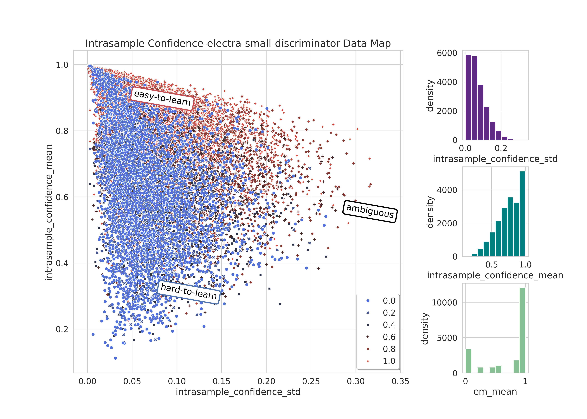
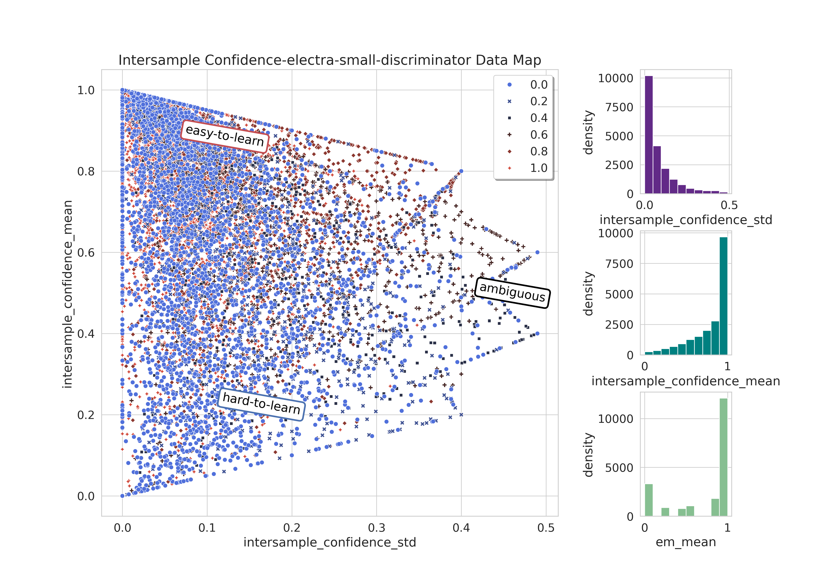

## Investigating Data Efficient Methods for Enhancing Model Generalization using Dataset Cartography, Augmentation, and Perturbation Techniques

## [Download Paper](https://kevinrohling.com/spuq-cartography.pdf)

---

### Abstract

This repository accompanies the paper *Investigating Data Efficient Methods for Enhancing Model Generalization using Dataset Cartography, Augmentation, and Perturbation Techniques*. This work investigates data-efficient strategies for improving generalization using [Dataset Cartography](https://arxiv.org/abs/2009.10795), augmentation, and perturbation-based uncertainty quantification techniques. We begin by establishing baseline performance using the `google/electra-small-discriminator` model trained on the [SQuAD](https://huggingface.co/datasets/rajpurkar/squad) dataset. We then extend the traditional Dataset Cartography calculation of intra-sample confidence and variability, derived from training dynamics, to also include inter-sample confidence/variability using [Sampling with Perturbation for Uncertainty Quantification (SPUQ)](https://arxiv.org/abs/2403.02509), allowing us to also capture a measure of epistemic uncertainty. Both metrics are then used to map training examples in terms of their variability, allowing us to select subsets of examples for training, focusing on those with high variability. These subsets are tested with multiple data augmentation strategies and used to train separate models, which are evaluated on both in-domain and out-of-domain performance. In total we evaluate 20 different experimental configurations, including training on subsets selected by intra-sample, inter-sample, and aggregated variability, with and without data augmentation.

We find that while training on the full dataset yields the strongest in-domain performance, targeting subsets of highly variable (ambiguous) examples outperforms random subsets of equivalent size on both in-domain and out-of-domain evaluations, with the most significant gains observed in the latter. Data augmentation alone did not improve in-domain performance but did result in performance improvements for out-of-domain evaluation. The most substantial improvements were achieved by training on subsets selected by aggregated variability, which combines intra-sample and inter-sample uncertainty metrics, and augmenting with both paraphrased and adversarial examples. These findings suggest that focusing on challenging examples and augmenting training data is a data efficient method for enhancing model robustness and generalization to out-of-domain distribution shifts.

---

### Repository Overview

This repository provides scripts and utilities to reproduce all of the experiment results.

The main scripts are as follows:

1. `train_baseline_model.py`: Trains a baseline model and computes cartography metrics.
2. `train_models_with_dataset_partitions.py`: Trains models using dataset partitioning strategies based on cartography metrics.

The `run.sh` script will execute the entire process. If a Weights & Biases API Key is supplied all results will be logged and uploaded there. Note that the easiest way to use this repository is with the pre-built Docker container on DockerHub.

---

### Docker Container

This project includes a Docker container for easily reproducing experiment results. The container is designed for easy deployment on platforms like [RunPod.io](https://www.runpod.io). A pre-built image is available on [Docker Hub](https://hub.docker.com/repository/docker/krohling/spuq-cartography/).
**Note:** This image only supports the `amd64` architecture and will not run on Apple Silicon. You really want a GPU environment to run this code anyway.

#### Using the Pre-Built Docker Image

1. **Pull the Docker Image**:
    ```bash
    docker pull krohling/spuq-cartography
    ```

2. **Run the Docker Container**:
    The container is ready to use and includes all necessary dependencies for running the scripts. Note that none of the environments are required and the script can be run with defaults however, it is recommended to modify the batch size to fit your hardware configuration.

    Example:
    ```bash
    docker run -it \
        -v $(pwd)/output:/opt/ml/output \
        -e WANDB_PROJECT="your_wandb_project" \
        -e WANDB_ENTITY="your_wandb_entity" \
        -e WANDB_API_KEY="your_wandb_api_key" \
        -e BASELINE_NUM_EPOCHS="5" \
        -e BASELINE_BATCH_SIZE="1" \
        -e PARTITIONS_NUM_EPOCHS="5" \
        -e PARTITIONS_BATCH_SIZE="1" \
        krohling/spuq-cartography
    ```

#### Building the Docker Image Locally

If you prefer to build the Docker image locally, use the provided `Dockerfile`.

1. **Build the Image**:
    ```bash
    docker build -t spuq-cartography .
    ```

2. **Run the Image**:
    ```bash
    docker run -it \
        -v $(pwd)/output:/opt/ml/output \
        -e WANDB_PROJECT="your_wandb_project" \
        -e WANDB_ENTITY="your_wandb_entity" \
        -e WANDB_API_KEY="your_wandb_api_key" \
        -e BASELINE_NUM_EPOCHS="5" \
        -e BASELINE_BATCH_SIZE="1" \
        -e PARTITIONS_NUM_EPOCHS="5" \
        -e PARTITIONS_BATCH_SIZE="1" \
    ```

#### Environment Variables

The Docker container supports the following environment variables to configure the runtime behavior:

- **`WANDB_PROJECT`**: The name of the W&B (Weights & Biases) project where metrics will be logged. (Required if using W&B).
- **`WANDB_ENTITY`**: The W&B entity (username or team) for logging. (Required if using W&B).
- **`WANDB_API_KEY`**: Your W&B API key for authentication. (Required if using W&B).
- **`BASELINE_NUM_EPOCHS`**: Number of epochs for baseline training. Defaults to `5`.
- **`BASELINE_BATCH_SIZE`**: Batch size for baseline training. Defaults to `1`.
- **`PARTITIONS_NUM_EPOCHS`**: Number of epochs for training with dataset partitions. Defaults to `5`.
- **`PARTITIONS_BATCH_SIZE`**: Batch size for training with dataset partitions. Defaults to `1`.

---

### Local Environment

To set up a local environment:

1. Clone this repository:
    ```bash
    git clone https://github.com/krohling/spuq-cartography
    cd spuq-cartography
    ```

2. Create a virtual environment and install dependencies:
    ```bash
    python3 -m venv env
    source env/bin/activate
    pip install -r requirements.txt
    ```

2. Run both baseline training and dataset partition experiments:
    ```bash
    ./run.sh
    ```

---

### Scripts and Usage

#### 1. `train_baseline_model.py`

This script trains a baseline model on the squad dataset and evauluation metrics are computing using the squad validation set. The `augmentation_dataset_id` is used to compute intersample variability metrics using SPUQ. Note that other datasets have not been tested and may encounter issues. At the end of each epoch, validation results and both intra-sample and inter-sample cartography metrics are saved to the output directory.

**Example Usage**:
```bash
python train_baseline_model.py \
    --model_id "google/electra-small-discriminator" \
    --train_dataset_id "squad" \
    --augmentation_dataset_id "kevin510/squad_paraphrasing_5" \
    --num_epochs 5 \
    --batch_size 1 \
    --output_dir "./output/"
```

**Arguments:**
- `--model_id`: Model identifier or path `(default: google/electra-small-discriminator)`.
- `--train_dataset_id`: Dataset identifier for training and validation (default: `squad`). 
- `--augmentation_dataset_id`: Dataset identifier for augmentations (default: `kevin510/squad_paraphrasing_5`).
- `--num_epochs`: Number of training epochs (default: `5`).
- `--batch_size`: Batch size for training (default: `1`).
- `--output_dir`: Directory to save outputs (default: `./output`).


#### 2. `train_models_with_dataset_partitions.py` 
This script trains models using dataset partitions defined in the `partitions_configurations.json` file. A dataset map from the baseline model is required and can be generated by running `train_baseline_model.py`. At the end of each epoch, validation results are computed using both the train dataset (squad) and the provided out of domain dataset (AdversarialQA). Note that other datasets have not been tested and may encounter issues.

**Example Usage:**
```bash
python train_models_with_dataset_partitions.py \
    data/partitions_configurations.json \
    data/dataset_map.csv \
    --model_id "google/electra-small-discriminator" \
    --train_dataset_id "squad" \
    --ood_dataset_id "UCLNLP/adversarial_qa" \
    --num_epochs 5 \
    --batch_size 1 \
    --output_dir "./output/"
```

**Arguments:**
- `partitions_configuration_path`: Path to JSON file with dataset partition configurations.
- `dataset_map_path`: Path to CSV file containing the dataset map generated during baseline training.
- `--model_id`: Model identifier or path (default: `google/electra-small-discriminator`).
- `--train_dataset_id`: Dataset identifier for training and in-domain validation (default: `squad`).
- `--ood_dataset_id`: Dataset identifier for out-of-domain validation (default: `UCLNLP/adversarial_qa`).
- `--num_epochs`: Number of training epochs (default: `5`).
- `--batch_size`: Batch size for training (default: `1`).
- `--output_dir`: Directory to save outputs (default: `./output`).

---


### Results

For details on the experiments, dataset cartography plots, and performance metrics, refer to the paper.

#### In-Domain (SQuAD) F1 Scores

| **Configuration**               | **None** | **Paraphrasing** | **Adversarial** | **Both** |
|---------------------------------|----------|------------------|----------------|----------|
| Full Dataset                    | 85.2     | 85.2             | 85.2           | 85.1     |
| Random 33%                      | 80.3     | 80.6             | 81.4           | 81.8     |
| Intra-sample Variability (High) | 82.0     | 81.5             | 81.6           | 82.0     |
| Inter-sample Variability (High) | 81.1     | 81.2             | 80.7           | 81.9     |
| Aggregated Variability (High)   | 82.0     | 81.6             | 81.1           | 82.3     |

#### In-Domain (SQuAD) EM Scores

| **Configuration**               | **None** | **Paraphrasing** | **Adversarial** | **Both** |
|---------------------------------|----------|------------------|----------------|----------|
| Full Dataset                    | 77.4     | 77.2             | 77.2           | 77.3     |
| Random 33%                      | 71.2     | 72.1             | 72.4           | 72.5     |
| Intra-sample Variability (High) | 73.3     | 72.5             | 72.9           | 73.3     |
| Inter-sample Variability (High) | 71.7     | 71.3             | 71.2           | 72.8     |
| Aggregated Variability (High)   | 72.6     | 72.6             | 71.9           | 73.0     |

#### Out-Of-Domain (AdversarialQA) F1 Scores

| **Configuration**               | **None** | **Paraphrasing** | **Adversarial** | **Both** |
|---------------------------------|----------|------------------|----------------|----------|
| Full Dataset                    | 28.1     | 29.1             | 27.7           | 29.4     |
| Random 33%                      | 21.7     | 23.9             | 23.6           | 25.5     |
| Intra-sample Variability (High) | 24.7     | 25.9             | 25.0           | 27.0     |
| Inter-sample Variability (High) | 25.6     | 25.2             | 24.7           | 26.5     |
| Aggregated Variability (High)   | 24.0     | 26.5             | 25.6           | 27.9     |

#### Out-Of-Domain (AdversarialQA) EM Scores

| **Configuration**               | **None** | **Paraphrasing** | **Adversarial** | **Both** |
|---------------------------------|----------|------------------|----------------|----------|
| Full Dataset                    | 18.0     | 19.0             | 17.6           | 19.0     |
| Random 33%                      | 12.1     | 14.3             | 14.2           | 15.3     |
| Intra-sample Variability (High) | 15.4     | 15.8             | 15.5           | 17.5     |
| Inter-sample Variability (High) | 15.8     | 14.6             | 14.8           | 16.7     |
| Aggregated Variability (High)   | 14.9     | 16.8             | 16.0           | 18.4     |

#### Dataset Cartography Plot using Intrasample Variability



#### Dataset Cartography Plot using Intersample Variability (SPUQ)



---

### Datasets

- **[SQuAD](https://huggingface.co/datasets/rajpurkar/squad)**: Used for in-domain training and evaluation.
- **[Adversarial QA](https://huggingface.co/datasets/UCLNLP/adversarial_qa)**: Used for out-of-domain evaluation.
- **[Paraphrased Augmentation Dataset](https://huggingface.co/datasets/kevin510/squad_paraphrasing_5)**: Used for computing intersample variability metrics (SPUQ) as well as data augmentation.
- **[Adversarial Augmentation Dataset](https://huggingface.co/datasets/kevin510/squad_adversarial)**: Used for data augmentation

---

### Runtime

These experiments were run using an NVIDIA A40 (48GB VRAM) GPU on [Runpod](https://runpod.io). Setting both batch size parameters to `192` the entire process completed in approximately `20 hours`. At least `50GB` of disk space is recommended to avoid process termination due to insufficient storage.

---

### References

*Max Bartolo, Alastair Roberts, Johannes Welbl, Sebastian Riedel, and Pontus Stenetorp. Beat the ai: Investigating
adversarial human annotation for reading comprehension. Transactions of the Association for Computational Linguistics, 8:662–678, December 2020. ISSN 2307-387X. URL http://dx.doi.org/10.1162/tacl a 00338.*

*Xiang Gao, Jiaxin Zhang, Lalla Mouatadid, and Kamalika Das. Spuq: Perturbation-based uncertainty quantification
for large language models, 2024. URL https://arxiv.org/abs/2403.02509.*

*Pranav Rajpurkar, Jian Zhang, Konstantin Lopyrev, and Percy Liang. Squad: 100,000+ questions for machine comprehension of text, 2016. URL https://arxiv.org/abs/1606.05250.*

*Swabha Swayamdipta, Roy Schwartz, Nicholas Lourie, Yizhong Wang, Hannaneh Hajishirzi, Noah A. Smith, and Yejin Choi. Dataset cartography: Mapping and diagnosing datasets with training dynamics, 2020. URL https://arxiv.org/abs/2009.10795.*

*Kevin Clark, Minh-Thang Luong, Quoc V. Le, and Christopher D. Manning. Electra: Pre-training text encoders as discriminators rather than generators, 2020. URL https://arxiv.org/abs/2003.10555.*

